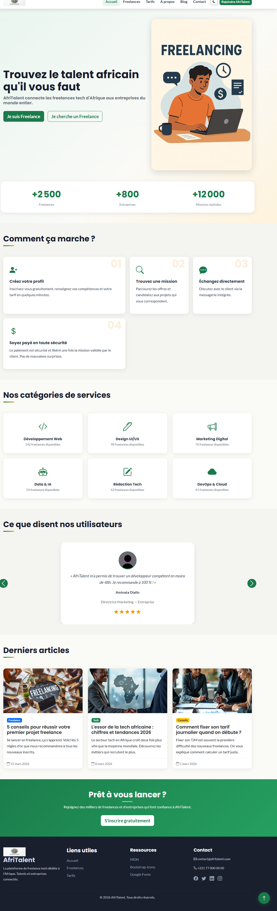
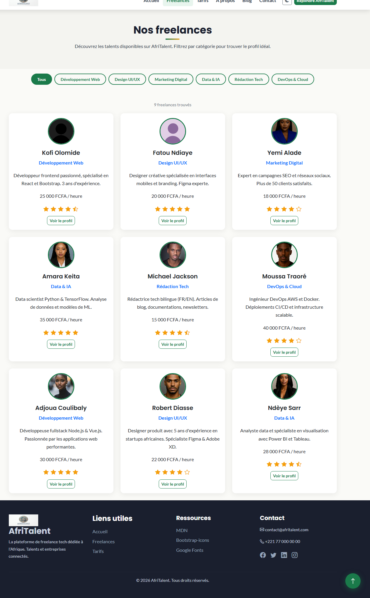
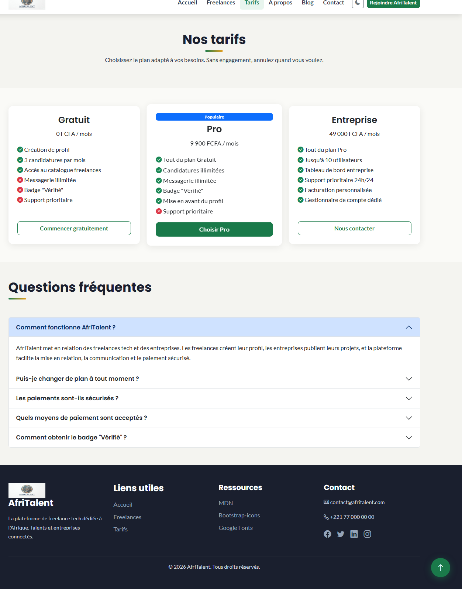
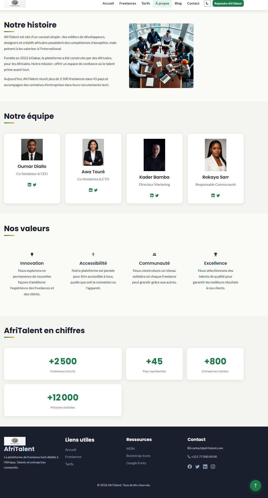
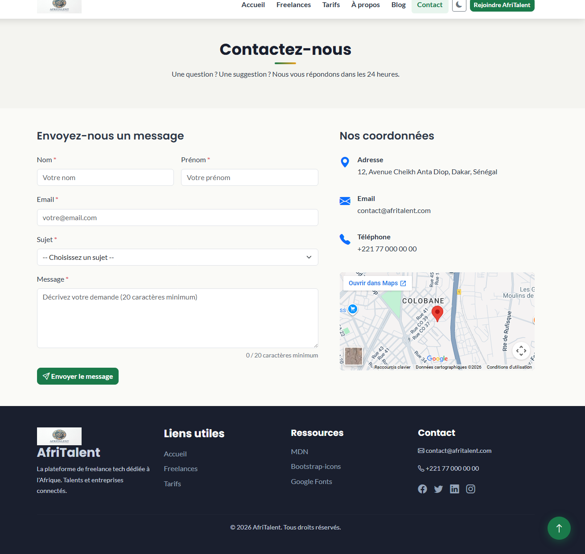

# AfriTalent
Projet fil rouge — Plateforme de mise en relation entre freelances africains et
clients.
Auteur : Seynabou Diacene
Promotion : L1 IAGE — ISI

 **Site en ligne :** <https://seynaboudiacene8-pixel.github.io/Diacene-Seynabou-AfriTalent/>


## Aperçu du site






)
*Page d’accueil — Hero, statistiques animées, catégories de services*

)
*Page Freelances — Catalogue filtrable par catégorie*

-----

##  Objectif du projet


AfriTalent répond à un constat simple : de nombreux talents tech africains existent mais manquent de visibilité à l’international. La plateforme leur offre un espace pour se faire connaître et trouver des missions auprès d’entreprises du monde entier.

## Pages du site

|Page      |Fichier          |Description                                    |
|----------|-----------------|-----------------------------------------------|
|Accueil   |`index.html`     |Hero, étapes, catégories, témoignages, blog    |
|Freelances|`freelances.html`|Catalogue de freelances filtrable par catégorie|
|Tarifs    |`tarifs.html`    |3 plans tarifaires + FAQ                       |
|À propos  |`about.html`     |Histoire, équipe, valeurs, chiffres clés       |
|Contact   |`contact.html`   |Formulaire validé en JS + carte Google Maps    |

##  Technologies utilisées

- **HTML5** sémantique
- **CSS3** : variables, dark mode, animations, responsive design
- **JavaScript** vanilla (sans framework) : DOM, événements, IntersectionObserver
- **Bootstrap 5.3** : navbar, cards, accordion, carousel, grid system
- **Bootstrap Icons**
- **Google Fonts** (Poppins, Lato)

##  Fonctionnalités principales

-  Mode sombre avec sauvegarde des préférences (localStorage)
-  Compteurs animés au scroll (IntersectionObserver)
-  Filtrage dynamique des freelances par catégorie
-  Validation en temps réel du formulaire de contact
-  Design responsive (mobile, tablette, desktop)
-  Navbar dynamique et bouton retour en haut

## Architecture du projet

```
AfriTalent/
├── index.html
├── freelances.html
├── tarifs.html
├── about.html
├── contact.html
├── css/
│   └── style.css
├── js/
│   └── main.js
├── images/
└── docs/
    ├── accueil.png
    ├── freelances.png
    └── Diacene_Seynabou_Presentation.pptx
```

## Installation locale

```bash
git clone https://github.com/seynaboudiacene8-pixel/Diacene-Seynabou-AfriTalent.git
cd Diacene-Seynabou-AfriTalent
```

Ouvrir ensuite `index.html` dans un navigateur (ou utiliser l’extension “Live Server” de VS Code).

## Validation

- Code HTML validé sur [validator.w3.org](https://validator.w3.org) — 0 erreur bloquante
- Attributs `alt` présents sur toutes les images
- Code entièrement commenté (HTML, CSS, JS)

## Auteur

**Diacène Seynabou** — Projet réalisé dans le cadre d’un cursus de développement web (S2 — 2026).